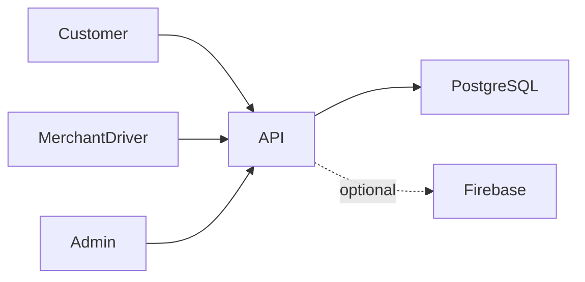

# لحظة

**منصة تجارة وتوصيل متعددة الأدوار**

[English](README.md)

تنسيق شراء العميل وتجهيز التاجر وتوصيل السائق وتسوية النقد لدى الإدارة ضمن منتج واحد.

**التقنيات:** React Native · Expo · NestJS · Prisma · PostgreSQL · React

## الحالة والتاريخ

نُشر واختُبر سابقاً، وكان متاحاً على Google Play لكنه غير متاح هناك حالياً. لا تتوفر تواريخ موثقة أو أسباب الإزالة أو أرقام الاستخدام.

هذه نسخة عرض منقحة للنشر. تعرض [وثيقة التحقق](docs/verification.ar.md) الفحوص الحالية بصورة مستقلة عن النشر السابق.

## الوظائف والإجراءات

- كتالوج العميل والمفضلة والعناوين والسلة والعروض
- تجهيز الطلبات وإدارة منتجات التاجر
- عروض السائق والتعيين والتتبع وحالات التوصيل
- إعدادات الإدارة ودفتر التاجر وأرباح السائق وتحويلات الدفع النقدي وإيصالات التسوية
- تكامل إشعارات Firebase وتغطية التوصيل حسب الموقع

يختار العميل العنوان والمنتجات ← يحسب الخادم الطلب ← يجهز التاجر ← يقبل السائق العرض ← تُحدَّث متابعة التوصيل ← تسوي الإدارة النقد وقيود الدفتر.

## البنية

## القرارات الهندسية

- يجمع المستودع تطبيق العميل وتطبيق السائق والتاجر ولوحة الإدارة والخادم مع الحفاظ على حدود المكونات.
- توثق ترحيلات Prisma تطور المخطط؛ تستخدم الخدمات المالية معاملات وفحص القيود السابقة. تكرار التسليم بالتتابع لا يثبت سلامة كل حالات التزامن.
- تقيد حراس الأدوار المسارات وتقيد فحوص الملكية السجلات؛ تحتاج المنصة الاثنين معاً.
- توجد إجراءات الدفع النقدي عند الاستلام. قيم تعداد الدفع لا تثبت وجود بوابة بطاقات فعالة.
- يسمح إعداد Firebase الاختياري بتشغيل الخادم دون نشر ملف حساب الخدمة.

## المجلدات

| المكون | المسؤولية |
|---|---|
| `customer/` | تطبيق العميل Expo وشيفرة أندرويد |
| `driver/` | تطبيق السائق والتاجر Expo |
| `admin/` | لوحة العمليات React وVite |
| `api/src/` | وحدات Nest للطلبات والنقد والسجلات والحسابات والإشعارات |
| `api/prisma/` | المخطط والترحيلات والتعبئة |

## التثبيت والإعداد

يلزم Node وnpm وPostgreSQL. داخل `api/` انسخ `.env.example` إلى `.env` وأنشئ قاعدة تجريبية ثم نفذ أوامر التثبيت وتوليد Prisma والترحيلات والبذر والتشغيل المذكورة أدناه. فعّل `SEED_DEMO_DATA=1` لقاعدة قابلة للحذف فقط. ثبّت لوحة الإدارة وتطبيقي Expo كلّاً في مجلده. استخدم عنوان خادم يمكن للهاتف الوصول إليه؛ localhost على الهاتف ليس الحاسوب.

توجد أوامر التشغيل ومتغيرات البيئة في [دليل الإعداد](docs/setup.ar.md). القيم أمثلة محلية أو حقول فارغة؛ لا تعِد استخدام بيانات إنتاج سابقة.

## العرض والتحقق

يختار العميل العنوان والمنتجات ← يحسب الخادم الطلب ← يجهز التاجر ← يقبل السائق العرض ← تُحدَّث متابعة التوصيل ← تسوي الإدارة النقد وقيود الدفتر.

استخدم حسابات وسجلات اصطناعية. راجع [خطوات العرض](docs/demo.ar.md) وسجل نتائج الفحوص الحالية. نجاح بناء مكون لا يثبت نجاح كل مسارات المنتج.

## الحدود

لم تُفحص أجهزة وبناء أندرويد والخرائط وFirebase وإشعارات عدة أجهزة والتحديثات المالية المتزامنة. نجح التكرار التسلسلي فقط. أوقف API قبل توليد Prisma أو الاستعادة على Windows لتجنب قفل DLL.

## التوثيق

- [البنية](docs/architecture.ar.md)
- [الإعداد](docs/setup.ar.md)
- [العرض](docs/demo.ar.md)
- [المسارات](docs/api.ar.md)
- [الفحوص الحالية](docs/verification.ar.md)
- [النشر وحل المشكلات](docs/deployment.ar.md)
- [حقوق الأصول](THIRD_PARTY_NOTICES.md)

## المساهمة والترخيص

افتح مشكلة تتضمن خطوات إعادة الإنتاج والمكون المعني. استخدم بيانات اصطناعية وتعديلات مركزة وفحوصاً مناسبة، ولا ترسل أسراراً أو سجلات مستخدمين خاصة. الشيفرة بترخيص [MIT](LICENSE)، وتحتفظ الاعتماديات والأصول الخارجية بشروطها الأصلية.

<!-- release-presentation -->

## من التطبيق الفعلي

هذه لقطة فعلية للواجهة المحلية، وليست دليلاً على استخدام إنتاجي أو فحص أندرويد.

## التحقق والقراءة المتعمقة

نجح بناء API ولوحة الإدارة. طبقت قاعدة PostgreSQL جديدة ترحيلات Prisma الستة عشر. نجح فحص مصادقة الأدوار الأربعة ورفض التسجيل كمدير والوصول لطلب آخر وخصم 10% وإتمام التسليم وقيد أرباح واحد للسائق والتاجر وعدم تكراره عند تكرار التسليم ورفض تغيير الحالة النهائية وتأكيد تحويل نقدي مرة واحدة.

لم تُفحص أجهزة وبناء أندرويد والخرائط وFirebase وإشعارات عدة أجهزة والتحديثات المالية المتزامنة. نجح التكرار التسلسلي فقط. أوقف API قبل توليد Prisma أو الاستعادة على Windows لتجنب قفل DLL.

- [دراسة المشروع](docs/case-study.ar.md)
- [التحقق](docs/verification.ar.md)
- [مخطط البنية](docs/architecture.svg)
- [صفحة المشروع](https://mohamed-abderrehmane-portfolio.wry-dog-0796.chatgpt.site/ar/projects/lahda/)
