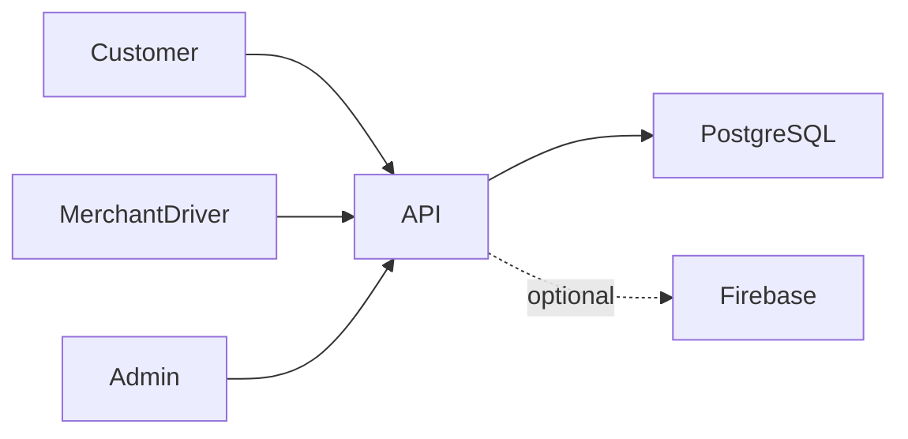
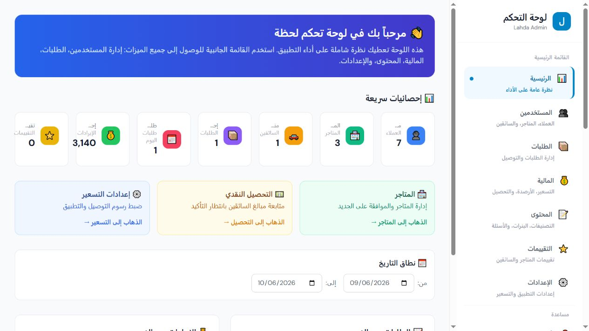

# Lahda

**Food and grocery delivery app**

[العربية](README.ar.md)

Order restaurant meals and daily groceries through a mobile app connected to merchant preparation, driver delivery and administration.

**Technology:** React Native · Expo · NestJS · Prisma · PostgreSQL · React

## Status and deployment history

Previously deployed and tested. Published on Google Play; the supplied application listing was verified accessible during this portfolio update.

This is a sanitized portfolio release. See the current [verification record](docs/verification.md) before choosing a runtime demonstration.

## Main workflows and implemented features

- Customer catalogue, favourites, addresses, cart and promotions
- Merchant order preparation and product management
- Driver offers, assignment, tracking and delivery status
- Admin settings, merchant ledgers, driver earnings, COD remittances and settlement receipts
- Firebase notification integration and location-aware delivery coverage

Customer chooses an address and products → API calculates the order → merchant prepares → driver accepts an offer → delivery updates tracking → admin reconciles cash and ledger entries.

## Architecture

## Engineering decisions

- A single repository retains customer, driver/merchant, admin and API boundaries so workflow changes can be reviewed together.
- Prisma migrations express schema evolution; money-related services use transactions and existing-entry checks. Sequential repeated delivery checks do not prove safety under every concurrent update.
- Role guards restrict endpoints, while ownership checks in services restrict records. Both are needed for multi-role data.
- Cash-on-delivery workflows are implemented. Payment enum labels do not establish a live card gateway.
- Optional Firebase setup lets the backend report disabled push integration without publishing a service-account file.

## Directory guide

| Component | Responsibility |
|---|---|
| `customer/` | Customer Expo application and Android source |
| `driver/` | Driver and merchant Expo application |
| `admin/` | React/Vite operations dashboard |
| `api/src/` | Nest modules for orders, COD, ledgers, accounts and notifications |
| `api/prisma/` | Schema, migrations and seed |

## Installation

Node 20 or a compatible supported runtime, npm and PostgreSQL are required. In `api/`, copy `.env.example` to `.env`, create the disposable database, install with `npm ci`, run `npm run prisma:generate`, `npm run prisma:migrate:deploy`, then `npm run prisma:seed` and `npm run start:dev`. Set `SEED_DEMO_DATA=1` only on a disposable database. Install and run the admin with `npm ci && npm run dev` from `admin/`. Install each Expo app in its own directory and run `npx expo start`. Configure a reachable API address for devices; device localhost is not the computer.

All required/private configuration is described in [setup](docs/setup.md). Examples contain placeholders or local demo values. Never reuse historical credentials.

## Demonstration

- Create synthetic customer, merchant and driver accounts; keep former infrastructure disconnected.
- Place a COD order, prepare it, accept the delivery offer, and complete delivery.
- Inspect the admin order, merchant credit, driver earning and remittance; repeat the delivered update and compare ledger entries.
- Use fresh Firebase configuration and Android debug signing for device checks.

## Verification and limitations

- API compilation and Prisma schema/client generation
- Role and foreign-order rejection
- Promotion totals and sequential repeated financial updates
- Admin compilation; Android build/device checks are separate

Maps, push notifications and Android services need independently configured integrations. Historical signing material and production records are excluded. Current compilation is not a complete device or financial concurrency audit.

## Documentation

- [Architecture](docs/architecture.md) · [العربية](docs/architecture.ar.md)
- [Setup and configuration](docs/setup.md) · [العربية](docs/setup.ar.md)
- [Demo walkthrough](docs/demo.md) · [العربية](docs/demo.ar.md)
- [API and execution paths](docs/api.md)
- [Verification record](docs/verification.md)
- [Deployment and troubleshooting](docs/deployment.md)
- [Asset attribution](THIRD_PARTY_NOTICES.md) · [MIT license](LICENSE)

## Contributing

Open an issue describing a reproducible problem, expected behavior and component involved. Use synthetic data. Keep changes focused and include relevant checks. Do not include credentials or private user records.

## License and attribution

Source code is MIT licensed. Third-party dependencies and assets retain their own terms; see [attribution](THIRD_PARTY_NOTICES.md).

<!-- release-presentation -->

## Actual application interface

Captured from the local application with synthetic records. This does not establish production usage or Android device verification.

## Verification and deeper reading

API and admin production builds passed. Fresh PostgreSQL initialization applied all 16 Prisma migrations. The synthetic acceptance script passed customer/merchant/driver/admin authentication, rejected admin self-registration and foreign-order access, verified a 10% discount, completed delivery, checked one driver earning and merchant entry, repeated delivery without additional entries, rejected terminal-state regression, and confirmed a remittance once. Fresh-database acceptance also verified discounted COD remittance: a 3,140 DZD customer total minus 1,000 DZD delivery equals 2,140 DZD remitted to administration. Repeating confirmation was rejected. The previous gross-subtotal formula incorrectly charged the driver for the customer discount and was corrected.

Android builds/device walkthroughs, fresh maps/Firebase integration, concurrent financial updates and multi-device notification delivery remain unverified. Repeated sequential updates passed; this is not proof of every concurrency scenario. Stop the API before Prisma generation/reset on Windows to avoid a locked query-engine DLL.

- [Case study](docs/case-study.md)
- [Verification](docs/verification.md)
- [Architecture diagram](docs/architecture.svg)
- [Portfolio case study](https://mohamed-abderrehmane-portfolio.hillock-factual9mupt.chatgpt.site/projects/lahda/)

- [Interface walkthrough and video](docs/walkthrough.md)

- [Engineering details and implementation lessons](docs/engineering-notes.md)

## App on Google Play

[Lahda — food and grocery delivery](https://play.google.com/store/apps/details?id=com.lahda.clients&hl=ar)
