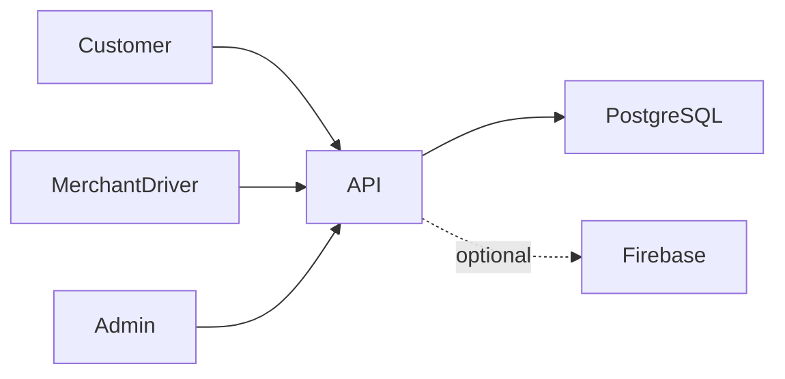

# بنية لحظة

يختار العميل العنوان والمنتجات ← يحسب الخادم الطلب ← يجهز التاجر ← يقبل السائق العرض ← تُحدَّث متابعة التوصيل ← تسوي الإدارة النقد وقيود الدفتر.

## القرارات والمفاضلات

- يجمع المستودع تطبيق العميل وتطبيق السائق والتاجر ولوحة الإدارة والخادم مع الحفاظ على حدود المكونات.
- توثق ترحيلات Prisma تطور المخطط؛ تستخدم الخدمات المالية معاملات وفحص القيود السابقة. تكرار التسليم بالتتابع لا يثبت سلامة كل حالات التزامن.
- تقيد حراس الأدوار المسارات وتقيد فحوص الملكية السجلات؛ تحتاج المنصة الاثنين معاً.
- توجد إجراءات الدفع النقدي عند الاستلام. قيم تعداد الدفع لا تثبت وجود بوابة بطاقات فعالة.
- يسمح إعداد Firebase الاختياري بتشغيل الخادم دون نشر ملف حساب الخدمة.

## مراجع الشيفرة

- [api/src/orders/orders.service.ts](../api/src/orders/orders.service.ts)
- [api/src/orders/delivery-offer.service.ts](../api/src/orders/delivery-offer.service.ts)
- [api/src/orders/cod-remittance.service.ts](../api/src/orders/cod-remittance.service.ts)
- [api/src/merchants/merchant-ledger.service.ts](../api/src/merchants/merchant-ledger.service.ts)
- [api/src/settlements/settlement-receipt.service.ts](../api/src/settlements/settlement-receipt.service.ts)
- [api/prisma/schema.prisma](../api/prisma/schema.prisma)

## الحدود

تحتاج الخرائط والإشعارات وأندرويد إلى إعدادات مستقلة. استُبعدت مفاتيح التوقيع والسجلات الإنتاجية. نجاح البناء لا يثبت فحصاً شاملاً للأجهزة أو التزامن المالي.
