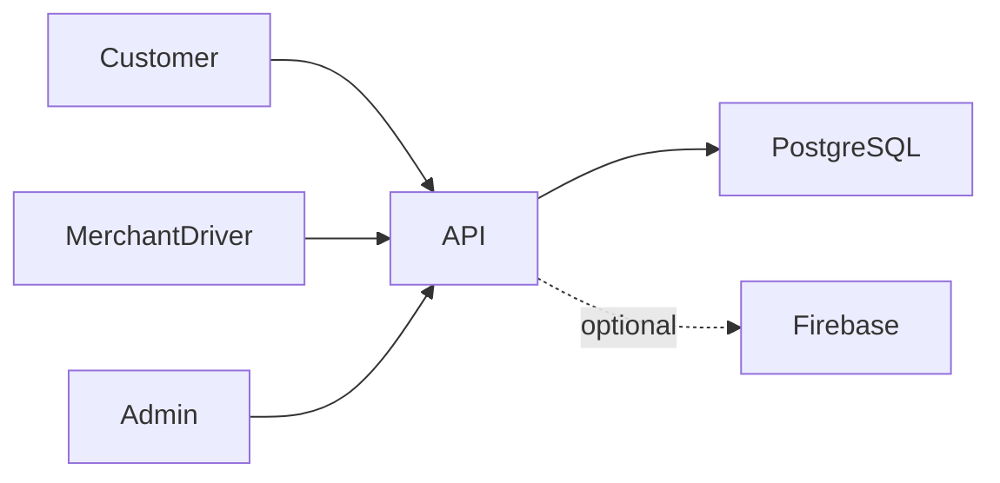

# Lahda architecture

Customer chooses an address and products → API calculates the order → merchant prepares → driver accepts an offer → delivery updates tracking → admin reconciles cash and ledger entries.

## Decisions and tradeoffs

- A single repository retains customer, driver/merchant, admin and API boundaries so workflow changes can be reviewed together.
- Prisma migrations express schema evolution; money-related services use transactions and existing-entry checks. Sequential repeated delivery checks do not prove safety under every concurrent update.
- Role guards restrict endpoints, while ownership checks in services restrict records. Both are needed for multi-role data.
- Cash-on-delivery workflows are implemented. Payment enum labels do not establish a live card gateway.
- Optional Firebase setup lets the backend report disabled push integration without publishing a service-account file.

## Component boundaries

| Component | Responsibility |
|---|---|
| `customer/` | Customer Expo application and Android source |
| `driver/` | Driver and merchant Expo application |
| `admin/` | React/Vite operations dashboard |
| `api/src/` | Nest modules for orders, COD, ledgers, accounts and notifications |
| `api/prisma/` | Schema, migrations and seed |

## Source evidence

- [api/src/orders/orders.service.ts](../api/src/orders/orders.service.ts)
- [api/src/orders/delivery-offer.service.ts](../api/src/orders/delivery-offer.service.ts)
- [api/src/orders/cod-remittance.service.ts](../api/src/orders/cod-remittance.service.ts)
- [api/src/merchants/merchant-ledger.service.ts](../api/src/merchants/merchant-ledger.service.ts)
- [api/src/settlements/settlement-receipt.service.ts](../api/src/settlements/settlement-receipt.service.ts)
- [api/prisma/schema.prisma](../api/prisma/schema.prisma)

## Limits

Maps, push notifications and Android services need independently configured integrations. Historical signing material and production records are excluded. Current compilation is not a complete device or financial concurrency audit.
