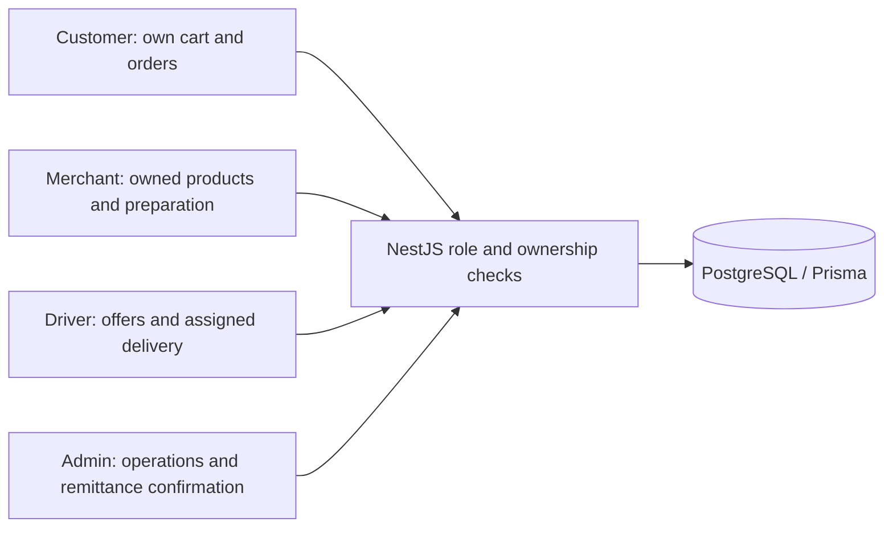
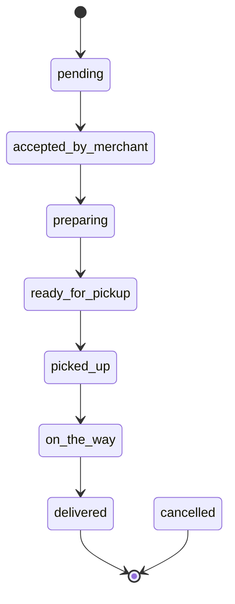
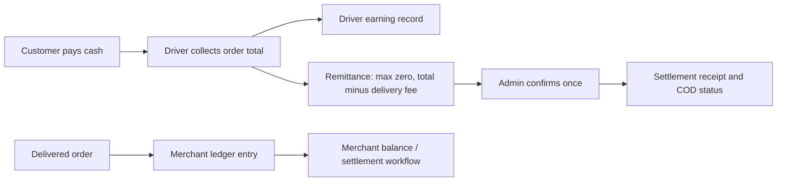

# الأدوار وحالة الطلب وحركة النقد

## الأدوار

## حالات الطلب

## النقد

يلخص مخطط الحالة ترتيب التسليم المعتاد؛ تحدد خدمات الطلب الصلاحيات والإلغاء ولا تثبت الأسهم قبول كل انتقال لكل دور. حالات cash/card/wallet في التعداد لا تثبت بوابة بطاقة. يحسب التحويل max(0, total ناقص deliveryFee) ليخفض خصم العميل النقد المحول، مع عرض subtotal وappFee قبل الخصم بصورة مستقلة. يحول الطلب التجريبي 2,140 دج من إجمالي 3,140 دج وتوصيل 1,000 دج. تتحقق فحوص النسخة من تكرار التسليم والتحويل تسلسلياً، دون ادعاء تغطية كل تنافس متزامن.

[Source: COD remittance service](../api/src/orders/cod-remittance.service.ts)
