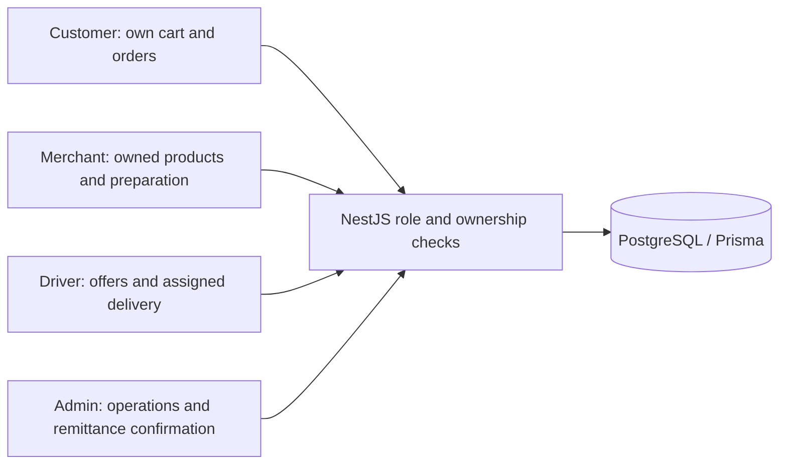
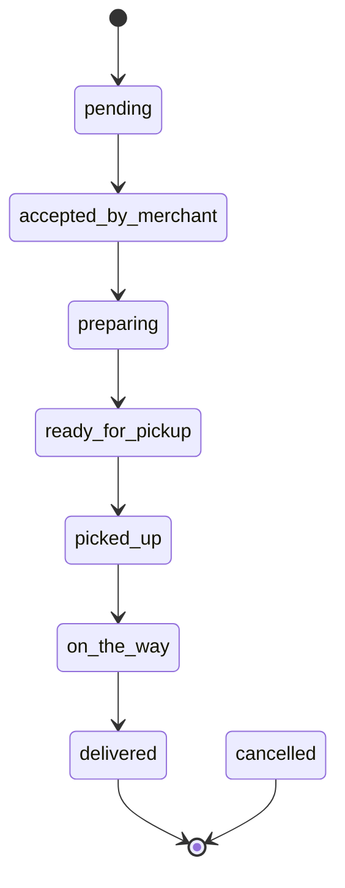
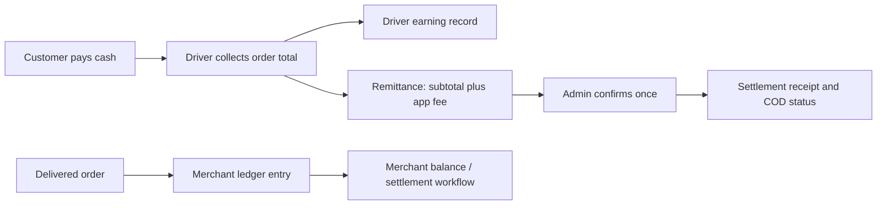

# Roles, order states and cash movement

## Role boundaries

## Order status vocabulary

## Cash accounting

The state diagram summarizes normal delivery order; order services define role permissions and cancellation. Arrows do not imply every role can execute every transition. The cash/card/wallet enum does not establish a card gateway. The remittance summary adds subtotal and appFee; deliveryFee is recorded separately. Release checks cover sequential delivery/remittance repetition, not every concurrent race.

[Source: COD remittance service](../api/src/orders/cod-remittance.service.ts)
